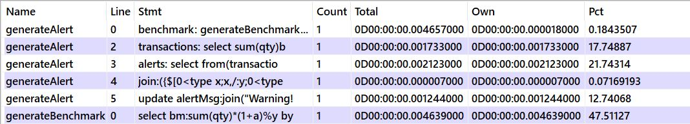

# kdb related repositories

Instructions for UTV Solution
1. cd to unusual-trade-vol/
2. q sln.q
3. unit tests are automatically run on load

Usage: generateAlert[data;daysToLookBack;threshold;alertDt]

# Profiling Results

